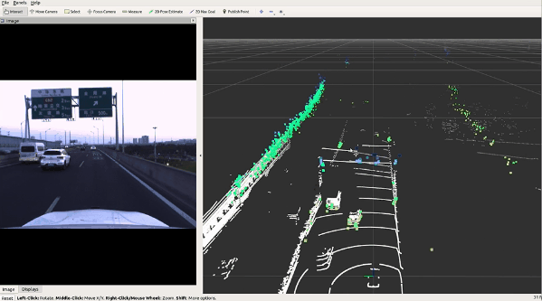
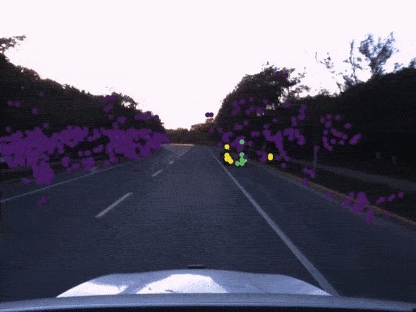
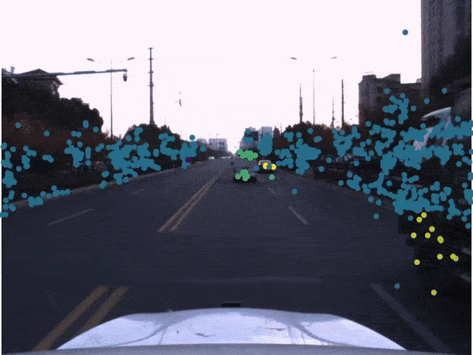
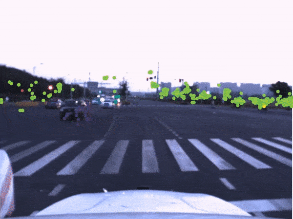
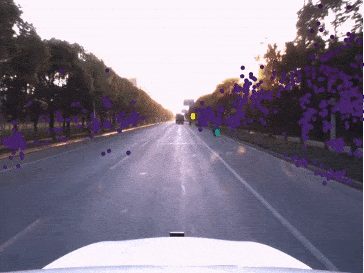
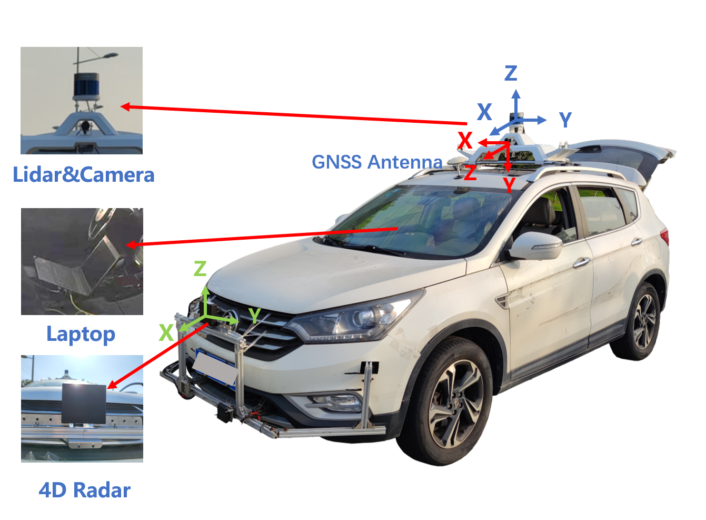
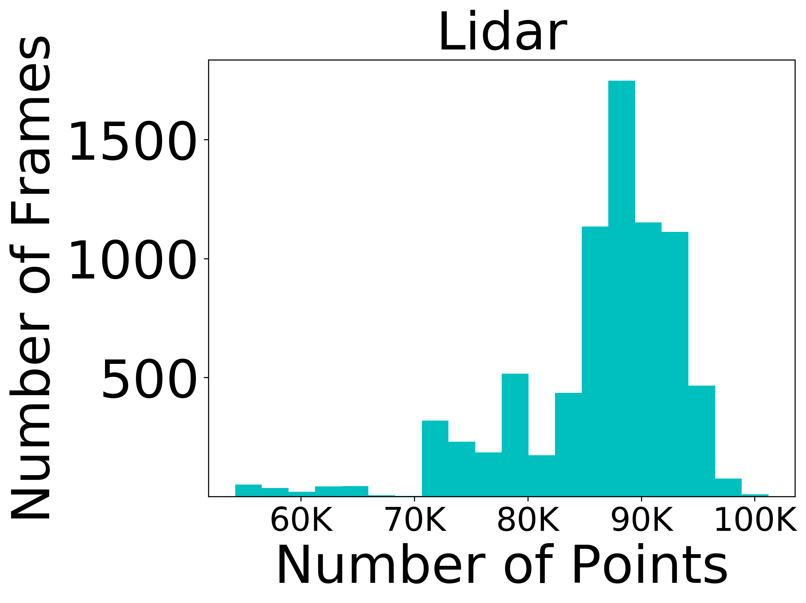
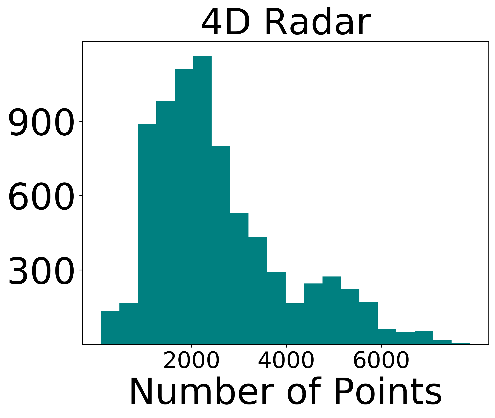
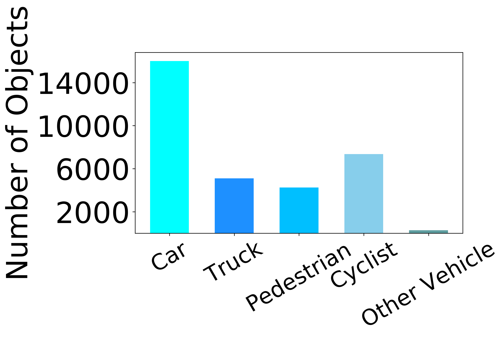
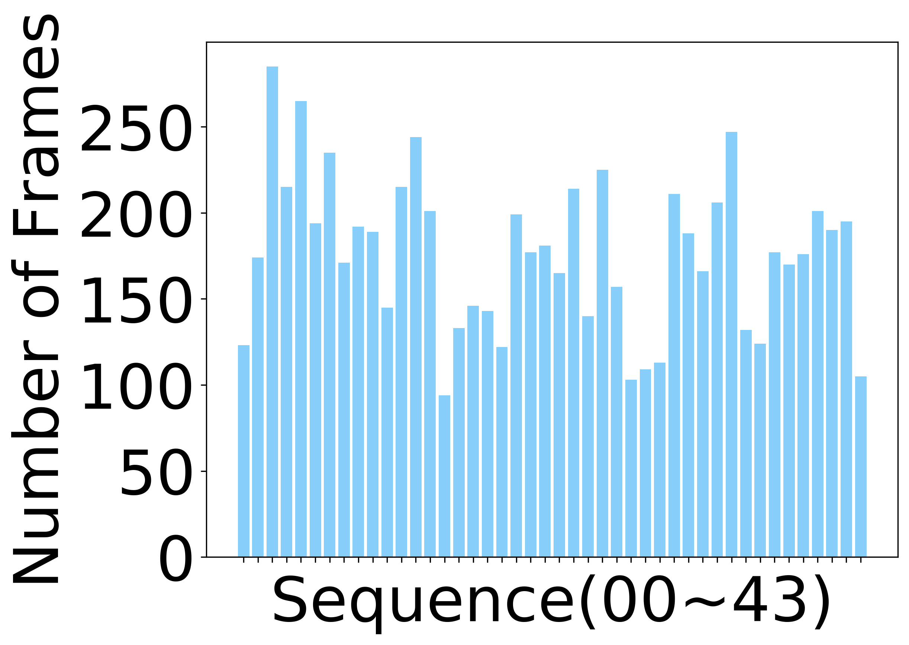

 
# TJ4DRadSet: A 4D Radar Dataset for Autonomous Driving

This repository provides a description and acquisition of TJ4DRadSet. Due to policy restrictions, we are currently releasing only the complete 4D radar data (it has no privacy implications).

<div align="center">
<p float="center">


<br />
<b>Example clip from our dataset with camera, LiDAR, 4D radar.</b>
</p>
</div>


<div align="center">
<p float="center">





<br />
<b>Example clip from our dataset with camera & 4D radar.</b>
</p>
</div>


## TJ4DRadSet Overview
- [Introduction](#introduction)
- [Annotation](#annotation)
- [Access_License](#access_license)
- [Acknowledgement](#acknowledgement)
- [Citation](#citation)
<br>

## Introduction
TJ4DRadSet is a novel 4D radar dataset containing 7757 frames of synchronized and calibrated LiDAR, camera, and 4D radar data in 44 sequences. 
It covers a wide range of driving conditions, including various lighting conditions, such as normal lighting, bright light and darkness, and different road types, such as urban roads, elevated roads, and industrial zones.

<div align="center">

<br />
<b>Data acquisition platform.</b>
</div>
<br>

<div align="center">
<p float="center">




<br />
<b>The dataset's statistical details.</b>
</p>
</div>

The dataset is organized similarly to KITTI as follows.

```
TJ4DRadSet_4DRadar
    ├── ImageSets
    │   │── train.txt
    |       ...
    │   │── readme.txt
    |
    ├── training
    │   │── calib
    │       ├──000000.txt
    │       ...
    │   │── image_2
    │       ├──000000.png
    │       ...
    │   │── label_2
    │       ├──020000.txt
    │       ...    
    │   │── velodyne
    │       ├──000000.bin
    │       ...  
    ├── Video_Demo
    │   │── seq04.mp4
    │       ...  

TJ4DRadSet_LiDAR
    ├── (On going)
```
Where, the `ImageSets` folder contains the initial split of the dataset. The `calib` folder contains 
calibration files, each of which has the following contents. The `P2` is the camera
intrinsic parameter matrix. The `Tr_velo_to_cam` is the extrinsic calibration between the 4D radar and the camera in KITTI format.
```
P0: 0.000000000000e+00 0.000000000000e+00 0.000000000000e+00 0.000000000000e+00 0.000000000000e+00 0.000000000000e+00 0.000000000000e+00 0.000000000000e+00 0.000000000000e+00 0.000000000000e+00 0.000000000000e+00 0.000000000000e+00
P1: 0.000000000000e+00 0.000000000000e+00 0.000000000000e+00 0.000000000000e+00 0.000000000000e+00 0.000000000000e+00 0.000000000000e+00 0.000000000000e+00 0.000000000000e+00 0.000000000000e+00 0.000000000000e+00 0.000000000000e+00
P2: 1.11042e+03 0.00000000e+00 6.25197e+02 0.00000000e+00 0.00000000e+00 1.11032e+03 4.62072e+02 0.00000000e+00 0.00000000e+00 0.00000000e+00 1.00000000e+00 0.00000000e+00
P3: 0.000000000000e+00 0.000000000000e+00 0.000000000000e+00 0.000000000000e+00 0.000000000000e+00 0.000000000000e+00 0.000000000000e+00 0.000000000000e+00 0.000000000000e+00 0.000000000000e+00 0.000000000000e+00 0.000000000000e+00
R0_rect: 1.000000000000e+00 0.000000000000e+00 0.000000000000e+00 0.000000000000e+00 1.000000000000e+00 0.000000000000e+00 0.000000000000e+00 0.000000000000e+00 1.000000000000e+00
Tr_velo_to_cam: 0.01307991 -0.9998881 -0.00723589 0.00368563 -0.0598935 0.00644008 -0.998184 1.3341627 0.9981189 0.01348954 -0.0598025 2.8750224
```

The `velodyne` folder contains 4D radar files. The radar point clouds are converted into bin files, each of which contains a Nx8 array. 
```
[X, Y, Z, V_r, Range, Power, Alpha, Beta]
```
Where N is the number of points and 8 is the feature dimension as follows. Where `V_r` is the relative radial velocity (RRV), `Range` is the detection range to radar center, `Power` is
in dB scale and represents the signal to noise ratio of the detection, `Alpha` and `Beta` are horizontal angle and vertical angle of
the detection, respectively.


## Annotation
The `label_2` folder provides the annotation file for each frame. We converted the annotations into KITTI format as follows. There are some differences between TJ4DRadSet and KITTI annotations:
- **Type**: The annotation contains 5 types of objects ('Car', 'Pedestrian', 'Cyclist', 'Truck', 'Other'), which are mapped from the original 7 classes of objects.
- **Truncated**: Integer 0(non-truncated) and 1(truncated), according to whether the object is at the image boundary or not. We did not use it in our study.
- **Occluded**: Integer (0,1,2,3) indicating occlusion state: 0 = fully visible, 1 = small partly occluded, 2 = partly occluded, 3 = largely occluded. We did not use it in our study.
- **Alpha**: Integer 0. Not used, only there to be compatible with KITTI format.
- **Bbox**: Annotation was done in 3D on the LiDAR point cloud. While we provide the 2D bounding boxes in the KITTI formatted labels, these were calculated automatically by projecting the 3D bounding boxes to the camera plane, and assigning a minimum fit rectangle.
```
#Values    Name      Description
----------------------------------------------------------------------------
   1    type         Describes the type of object: 'Car', 'Pedestrian', 'Cyclist', 'Truck', 'Other'.
   1    truncated    Integer 0(non-truncated) and 1(truncated).
   1    occluded     Integer (0,1,2,3) indicating occlusion state:
                     0 = fully visible, 1 = small partly occluded
                     2 = partly occluded, 3 = largely occluded.
   1    alpha        Integer 0. Not used.
   4    bbox         2D bounding box of object in the image (0-based index):
                     contains left, top, right, bottom pixel coordinates. This was automatically calculated from the 3D boxes.
   3    dimensions   3D object dimensions: height, width, length (in meters)
   3    location     3D object location x,y,z in camera coordinates (in meters)
   1    rotation     Rotation ry around Y-axis in camera coordinates [-pi..pi]
```
The tracking annotations are also similar to KITTI format. They are the original annotations of each sequence in the LIDAR coordinate system.
The first column represents the frame number, the second column is the tracking ID, and the third column is the class information. In addition, the annotated classes include the original seven types, which are `Car`, `Pedestrian`, `Cyclist`, `Motorcyclist`, 
`Truck`, `Bus`, `Engineering Vehicles`. An example is as follows.

```
0146 1 Car 0 0 0 457.85464785685105 418.51925272853106 505.77782401266194 455.7979273624884 1.7466730863223 1.8669869318777 4.2109833800027 57.295082952354 5.8145053914078 -2.1813235271045 -0.034961978689325
0146 3 Car 0 0 0 662.7697937503474 413.50692430585116 748.8161098837493 464.9817409351426 1.7053787409195 1.8290438613674 4.5334482016139 40.906472273243 -3.9593908896461 -1.708882967783 0.21957524996303
......
```
## Access_License
The dataset is made freely available for non-commercial research purposes only. Eligibility to use the dataset is limited to College/University students. You need to send the specified email address according to the [Non-Disclosure Agreement](https://pan.baidu.com/s/1h3Vbbctxf55PoQi8ZaA5lQ?pwd=tj4d
) (please use Chinese).[Please send it using your tutor’s email, the unified processing time is every Monday.]


## Acknowledgement
* Annotation was done by [Testin](https://ai.testin.cn/), an AI data services company.
* We thank the maintainers of the following repos that enable us to develop our dataset: [OpenPCDet](https://github.com/open-mmlab/OpenPCDet) and [MMDetection3D](https://github.com/open-mmlab/mmdetection3d) by MMLab, [simple_kitti_visualization](https://github.com/zzzxxxttt/simple_kitti_visualization) by zzzxxxttt, [3D-Detection-Tracking-Viewer](https://github.com/hailanyi/3D-Detection-Tracking-Viewer) by hailanyi.
* We referred to [the View of Delft dataset](https://github.com/tudelft-iv/view-of-delft-dataset) and are grateful to Dr. Andras Palffy for his email correspondence and help.
* We are grateful for the financial support from the National Key R&D Program and the help from Suzhou Millimeter-wave Technology Co. LTD.
## Citation
If you find this work is useful for your research, please consider citing:

```
@INPROCEEDINGS{9922539,  
author={Zheng, Lianqing and Ma, Zhixiong and Zhu, Xichan and Tan, Bin and Li, Sen and Long, Kai and Sun, Weiqi and Chen, Sihan and Zhang, Lu and Wan, Mengyue and Huang, Libo and Bai, Jie},  
booktitle={2022 IEEE 25th International Conference on Intelligent Transportation Systems (ITSC)},   
title={TJ4DRadSet: A 4D Radar Dataset for Autonomous Driving},   
year={2022},  
volume={},  
number={},  
pages={493-498},  
doi={10.1109/ITSC55140.2022.9922539}}
```
