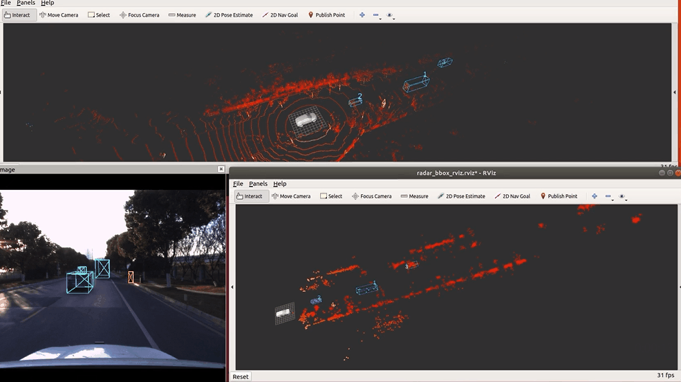

 
# TJ4DRadSet: A 4D Radar Dataset for Autonomous Driving

This repository provides a description and acquisition of TJ4DRadSet.Our paper has been accepted by IEEE ITSC 2022! 
The dataset will be released gradually after the conference(2022.10.8-10.12)

<figure>

</figure>
 <figure>

</figure>
 <figure>

</figure>
 
<b>Example clip from our dataset with camera, LiDAR, 4D radar.</b>

 
 

<figure>

</figure>
 <figure>

</figure>
 
<b>Example clip from our dataset with camera & 4D radar.</b>

 
 
---
